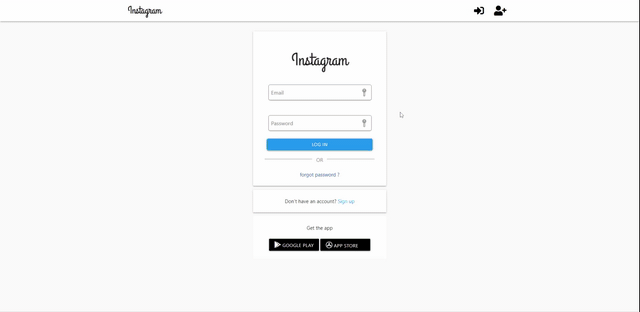

## Instagram Clone

This project is based on MERN stack. It is the replica of Instagram app with all the similar functionalities baked into it.

#### Live demo - http://instagram-mern.herokuapp.com/

Note: [For demo please use these credentials] email: `guest@guest.com` password: `guest`

### Front End:

##### Technologies used:

- React
- Redux (State Management)
- React-Router (Routing)
- React-Image-Crop (For image cropping/editing/optimizing before uploading)
- Materializecss (UI library)
- isMobilejs (to detect mobile devices - custom designs)

### Back End:

##### Technologies used:

- Nodejs
- ExpressJS (Server)
- MongoDB (Database)
- Mongoose (Object Modeling tool)
- bcrypt (hashing passwords)
- jsonwebtoken (token generation for sessions)

#### Preview:

### Setup the project on local environment

##### Prerequesties:
1. Nodejs & npm
2. MongoDB (try MongoDB Atlas instead of local installation)
3. cmd/terminal on your local host

##### Steps:
1. Clone this git repo on your local machine using `git clone https://github.com/abhishekchohan/instagram-clone.git`
2. Make sure you are inside root directory and run `npm install` and wait for few moments.
3. Move inside the client directory using `cd client` and run `npm install` again and wait for few more movments.
4. Now rename `example.env` to `.env` and make sure you add your `JWT_SECRET` and `MONGO_DB_URI` to it. (!Important)
5. Now you need to separate cmd/terminals
                - (open one cmd/terminal in client folder && run `npm start` and it should popup browser with our APP)
                - (open second cmd/terminal in root folder && run `npm start` and it should say Database connected and running on port 5000)
6. If everything goes well, you will be running this clone on local environment.
